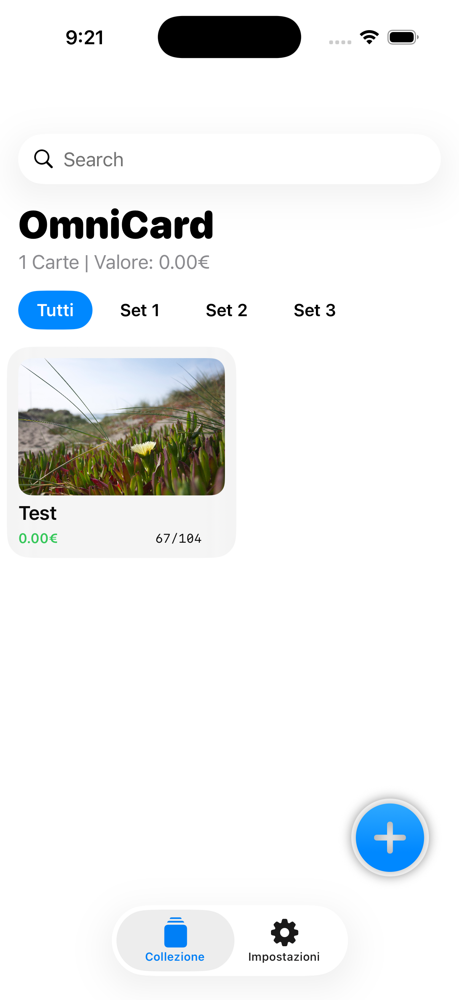
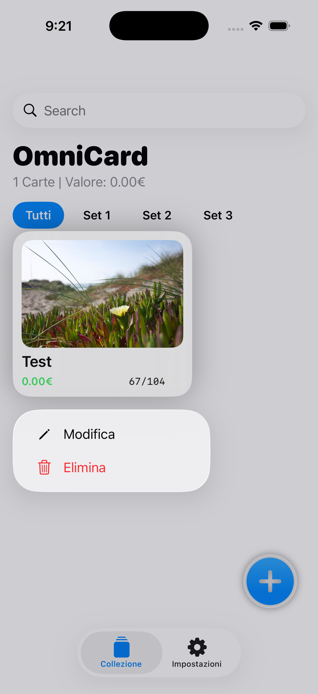
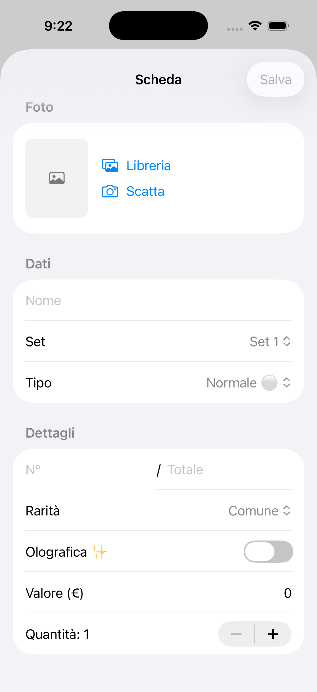
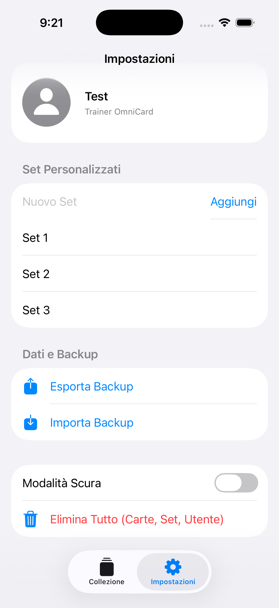

# OmniCard 📦

Un'app iOS per collezionisti di carte da gioco collezionabili (TCG), costruita interamente in **SwiftUI**. Cataloga, fotografa e tieni traccia del valore della tua collezione — tutto offline, tutto sul tuo dispositivo.

---

## Funzionalità

- **Catalogazione completa** — aggiungi carte con nome, set, tipo, numero, rarità, quantità e valore di mercato
- **Foto delle carte** — scatta direttamente dalla fotocamera o importa dalla libreria foto
- **Filtro per set** — naviga la collezione per set tramite chip interattivi
- **Ricerca** — barra di ricerca nativa integrata nella navigation
- **Valore totale** — calcolo automatico del valore complessivo della collezione (quantità × prezzo)
- **Olografiche** — flag dedicata per le carte holofoil, con badge visivo nella griglia
- **Set personalizzati** — crea e gestisci set personalizzati oltre a quelli predefiniti
- **Backup e ripristino** — esporta e importa l'intera collezione in formato JSON
- **Profilo utente** — nome e foto profilo personalizzabili
- **Dark mode** — supporto completo con toggle nelle impostazioni

---

## Screenshot

| Collezione | Modifica | Aggiungi Carta | Impostazioni |
|---|---|---|---|
|  |  | | |

---

## Requisiti

| Requisito | Versione |
|---|---|
| iOS | 26.4+ |

---

## Installazione

### Metodo 1 — AltStore (consigliato)

1. Installa [AltStore](https://altstore.io) sul tuo iPhone
2. In AltStore, vai su **Sources** e aggiungi la repo:
   ```
   https://stefa008.github.io/OmniCard/apps.json
   ```
3. OmniCard apparirà nella scheda **Browse** — premi **Free** per installarla

### Metodo 2 — File IPA manuale

1. Scarica l'ultima versione di `OmniCard.ipa` dalla sezione [Releases](https://github.com/stefa008/OmniCard/releases)
2. Sideload tramite AltStore (**+** in basso → seleziona il file IPA) oppure con [Sideloadly](https://sideloadly.io)
   
---

### Decisioni tecniche 

**Fotocamera via UIKit diretto** — La presentazione della `UIImagePickerController` avviene tramite `CameraPresenter`, che risale la catena dei `presentedViewController` fino al top. Questo evita il crash garantito causato dall'annidamento di un `fullScreenCover` dentro un `.sheet` su hardware reale.

**Persistenza** — Tutto è salvato su `UserDefaults` tramite `JSONEncoder/JSONDecoder`. Le immagini vengono scritte nella `documentDirectory` come JPEG compressi al 70%, e ogni carta ne conserva solo il nome file.

**Nessuna dipendenza esterna** — L'app usa esclusivamente framework Apple nativi.

---

### Rarità disponibili

`Comune` · `Non Comune` · `Rara` · `Olografica` · `Ultra Rara` · `Fuori Serie`

### Tipi disponibili

Normale, Fuoco, Acqua, Erba, Elettro, Lotta, Veleno, Terra, Volante, Psico, Coleottero, Roccia, Spettro, Drago, Buio, Acciaio, Folletto, Ghiaccio, Allenatore, Oggetto

---

## Backup

Il backup esporta un file `OmniCard_Global_Backup.json` contenente:
- Tutte le carte della collezione
- I set personalizzati
- Il nome utente
- Il percorso dell'immagine profilo

> ⚠️ Le immagini delle carte **non** sono incluse nel backup JSON — sono salvate nella `documentDirectory` del dispositivo. Per un backup completo, considera di includere anche quella cartella tramite iTunes/Finder o iCloud.

---

## Autore

Fatto con ❤️ per i collezionisti di carte da gioco.
